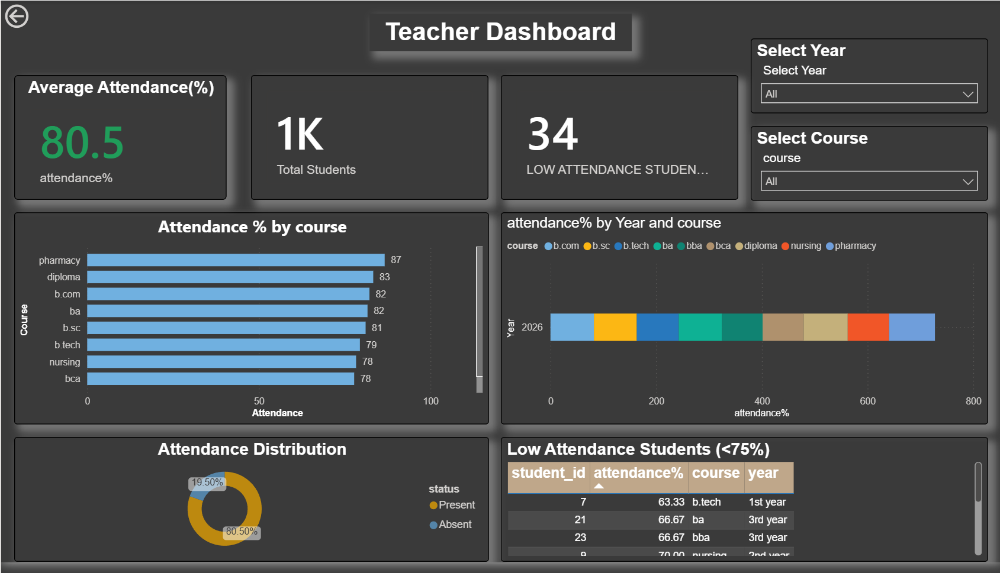
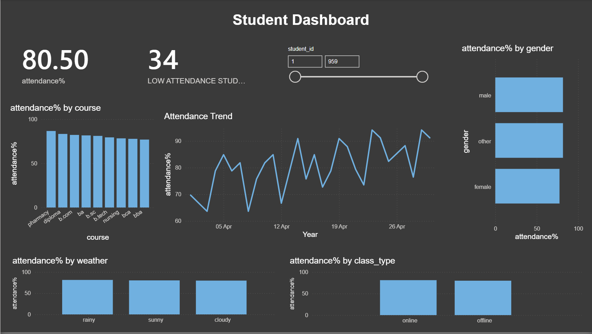
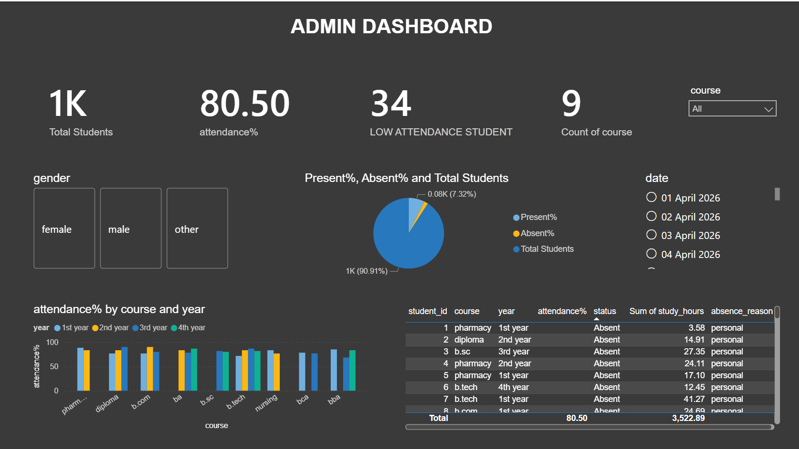

# 📊 Attendance Management Dashboard

## 📌 Project Overview
This project is an **Attendance Management Analytics System** built using **SQL** and **Power BI**.  
It analyzes student attendance data and provides **role-based dashboards** for:

- 👩‍🏫 **Teachers**
- 🎓 **Students**
- 🏫 **Institution/Admin**

The system helps monitor attendance performance, identify low-attendance students, and generate institution-level insights.

---

## 🛠️ Tools & Technologies Used
- SQL (MySQL)
- Power BI
- CSV Dataset
- Data Cleaning & Transformation
- Data Visualization

---

## 📂 Project Structure
'''Attendance-Management-Dashboard/
│
├── Datasets/
├── Sql_queries/
├── PowerBi_Dashboard/
├── Screenshots/
└── README.md'''

---

## 📊 Dashboards Included

### 👩‍🏫 Teacher Dashboard
Features:
- Class-wise attendance overview  
- Low attendance student alerts  
- Present vs absent analysis  
- Attendance monitoring  

### 🎓 Student Dashboard
Features:
- Individual attendance tracking  
- Attendance percentage  
- Eligibility status  
- Attendance behavior insights  

### 🏫 Admin Dashboard
Features:
- Institution-level attendance analysis  
- Course/year comparison  
- Overall attendance KPIs  
- Low-performing course identification  

---

## 🧠 SQL Analysis Performed
- Database creation  
- Table relationships & foreign keys  
- Data cleaning  
- Attendance percentage calculation  
- Low attendance identification  
- Course-wise analysis  
- Year-wise analysis  
- Present vs absent analysis  
- Attendance trend analysis  

---

## 📈 Key Insights
- Identified students below **75% attendance**  
- Compared attendance across courses and years  
- Analyzed attendance behavior based on class type and weather  
- Generated institutional attendance insights for admins  

---

## 📸 Dashboard Screenshots

### 👩‍🏫 Teacher Dashboard

### 🎓 Student Dashboard

### 🏫 Admin Dashboard

---

## 🚀 Future Improvements
- Real-time attendance tracking  
- Login-based student filtering  
- Predictive attendance analytics  
- Mobile dashboard integration  

---

- **Harshita Sahni** – Attendance Dashboard & SQL Queries  

